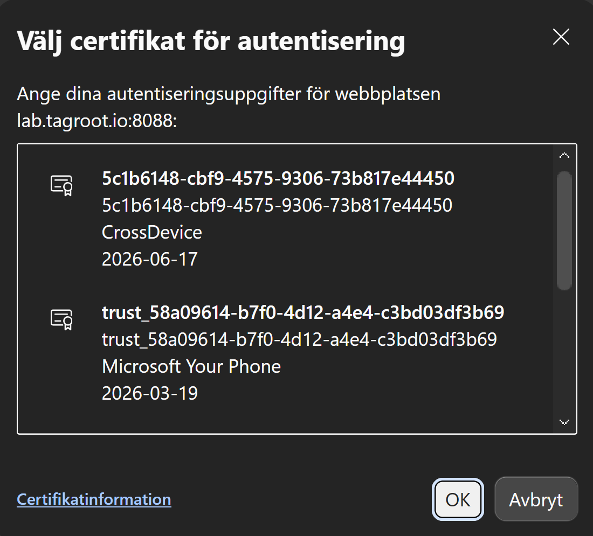
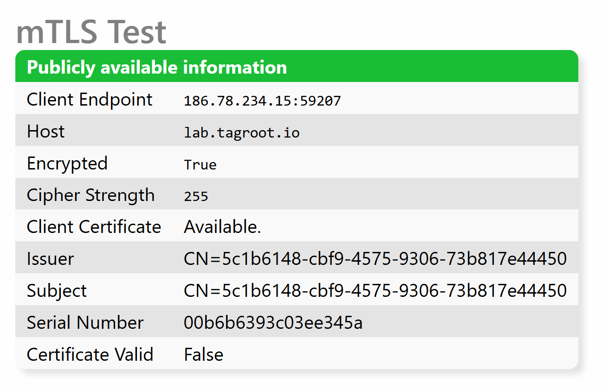

mTLSTest
===========

This repository contains tools for testing mTLS connectivity with a TAG Neuron(R). It contains
two main components:

* A simple web page and a simple web service that can be used to test mTLS connectivity. These
can be placed in a distributable package and be installed on the Neuron where you want to test 
mTLS connectivity. The web page will display simple information available about the client for
a human user. The web service will return the same information in a JSON encoded object,
permitting automated testing.

* A simple console application that can be run in .NET Core environments. It is written using
.NET Standard for maximum portability. using command-line arguments it allows a tester to
automate testing of mTLS connectivity. It also provides a simple application that can be used
as a template, or to troubleshoot mTLS connectivity issues.

You can try the web page directly on the lab neuron, by clicking [here](https://lab.tagroot.io/mTLSTest.md).
You can also access the [web service](https://lab.tagroot.io/mTLSTest.ws). 

Enabling mTLS on a Neuron
----------------------------

To enable mTLS on a Neuron, you need to configure the Neuron to at least optionally accept
client certificates. This is done in the `gateway.config` file. It is not recommended to
enable this on the entire Neuron, as it will make web browsers show needless certificate
dialogs to users, as they nagivate to the Neuron. Instead, it is recommended, you open 
secondary HTTPS ports for mTLS, where mTLS is enabled. You can require, or optionally accept
client certificates. For the purpose of this service, it is sufficient to optionally accept
client certificates, as it permits both users authenticating themselves using mTLS, and users
that employ other mechanisms to authenticate themselves.

The article [Controlling Multual TLS on a port level](https://lab.tagroot.io/Community/Post/Controlling_Multual_TLS_on_a_port_level)
explains how to configure the Neuron so an alternative HTTPS port is opened, with mTLS enabled.

Installable Package
----------------------

The contents of the `mTLSTest` project is available in an installable package that you can 
install on your Neuron(R).

| Package information                                                                                                              ||
|:-----------------|:---------------------------------------------------------------------------------------------------------------|
| Package          | `TAG.mTLSTest.package`                                                                                         |
| Installation key | `Of8CrE/a51VBCqGV4LguRBQeDN5jj4WYDdXaVF4IiHOTiQbXMoI2OcBO9YwrikWzvaeT8wWtgYYA2cb5e811b78906330cf6c911df3812f3` |

Installing package from the *Chat Admin*:

```
install nobackup TAG.mTLSTest.package Of8CrE/a51VBCqGV4LguRBQeDN5jj4WYDdXaVF4IiHOTiQbXMoI2OcBO9YwrikWzvaeT8wWtgYYA2cb5e811b78906330cf6c911df3812f3
```

Endpoints for Testing
------------------------

TAG provides the following endpoints for testing client implementations:

| Endpints                                                ||
|:-------------|:------------------------------------------|
| Web Page:    | `https://lab.tagroot.io:8088/mTLSTest.md` |
| Web Service: | `https://lab.tagroot.io:8088/mTLSTest.ws` |

### Testing using Browser

You can test mTLS using a Browser that allows clients to select certificates when the option
of mTLS is available. The following steps and images show how the Edge browser can be used
to test the mTLS connection. Similar steps can be followed for other browsers that support 
mTLS.

1.	Open an *In-Private* window in Edge. This will ensure the connection starts fresh, with no
knowledge about capabilities, and no cached information about the server. This step is 
important to ensure the certificate dialog in the next step is triggered.

2.	Navigate to the web page endpoint for testing mTLS: https://lab.tagroot.io:8088/mTLSTest.md

3.	A certificate dialog will appear. This dialog will contain client certificates available to
the browser. The certificates shown in Figure 1 below, are self-signed certificates created by
the browser itself. Select a certificate and click *OK*.

4.	A page will appear with the information about the certificate you selected. Figure 2 below
shows how this presentation may look like.

<figure>
	
	<figcaption><strong>Figure 1</strong>: Certificate dialog in Edge</figcaption>
</figure>

<figure>
	
	<figcaption><strong>Figure 2</strong>: Web Page Presentation</figcaption>
</figure>

### Testing using Unit Test

The [`mTlsPingApi.Test`](mTlsPingApi.Test) project contains simple unit tests for the 
`mTlsPingApi` class, which is used to communicate with the `mTLSTest.ws` web service endpoint.
Use Visual Studio or similar to run these tests. These tests can be used to verify mTLS
connectivity to any number of machines running the `mTLSTest.ws` web service, by providing
the necessary data rows. The unit test project also contains a self-signed certificate that
can be used for testing purposes. See the [`ApiTests.cs`](mTlsPingApi.Test/ApiTests.cs) file 
for more details.

### Testing using Command Line

The [`mTlsPing`](mTlsPing) project contains a command-line tool for testing mTLS connectivity 
using the `mTlsPingApi` class. This tool can be used to verify mTLS connectivity to any number
of machines running the `mTLSTest.ws` web service, by running the command-line tool and
providing the necessary command-line arguments. 

Usage:

```
mTlsPing -h <host> -p <port> -f <certificate file name> 
         -w <certificate password> [-t] [-x] [-m <timeout>] [-?]
```

The following table lists the command-line arguments for the tool:

| Argument                     | Description                                                                                                 |
|:-----------------------------|:------------------------------------------------------------------------------------------------------------|
| `-h <host>`                  | Host name of Neuron.                                                                                        |
| `-p <port>`                  | HTTPS port where mTLS is enabled.                                                                           |
| `-f <certificate file name>` | File name of client certificate. The certificate must contain the private key.                              |
| `-w <certificate password>`  | Password for the client certificate.                                                                        |
| `-t`                         | Trust server certificate. This option makes the tool trust the server certificate, even if it is not valid. |
| `-x`                         | Use proxy if available. This option allows the tool to use a proxy server if one is configured.             |
| `-m <timeout>`               | Timeout in milliseconds. Default is 10000 (10 seconds).                                                     |
| `-?`                         | Show a help message.                                                                                        |

You can test the tool using the following command-line arguments. Run the tool from the
repository folder. Assuming the tool has been compiled with Visual Studio (or similar), in
Debug mode, the following will perform the same task, as the unit test described earlier
(new line characters added only for readability):

```
mTlsPing\bin\Debug\net8.0\mTlsPing.exe
	-h lab.tagroot.io 
	-p 8088 
	-f mTlsPingApi.Test\Data\certificate.pfx
	-w testexamplecom
```

Or as one row:

```
mTlsPing\bin\Debug\net8.0\mTlsPing.exe -h lab.tagroot.io  -p 8088 -f mTlsPingApi.Test\Data\certificate.pfx -w testexamplecom
```

The result from this command, is the following:

```
Client endpoint: 186.78.234.15:55114
Host: lab.tagroot.io
Encrypted: True
Cipher strength: 255
Client certificate: True
Issuer: E=test@example.com, OU=D, O=example.com, L=Stockholm, S=Stockholm, C=SE, CN=localhost
Subject: E=test@example.com, OU=D, O=example.com, L=Stockholm, S=Stockholm, C=SE, CN=localhost
Serial number: 00947fd2f9ef86d010
Valid: False
```

### Restrictions on Client Certificates

For a client certificate to be possible to use for mTLS authentication, the following must
be true about the certificate:

* The Certificate MUST contain a private key. Without a private key, the certificate cannot be
used to create signatures, and therefore not be used to authenticate the client to the server.

* IF the certificate contains a Key Usage (KU) extension (which restricts the ways in which the
certificate can be used), it MUST allow for digital signatures to be made using the certificate.
IF the KU extension exists, and digital signaatures are not allowed, even though the certificate
has a private key and can create signatures, it is not allowed to do so for authentication, and
will therefore not be selected for use in mTLS authentication.

* IF the certificate contains an Extended Key Usage (EKU) extension (which contains extended
restrictions for the certificate), it MUST allow the certificate to be used for TLS Web Client 
Authentication (OID `1.3.6.1.5.5.7.3.2`). If the EKU extension exists, and TLS Web Client 
Authentication is not present in the list of extended key usages, the certificate will not be
selected for use in mTLS authentication, as the CA does not allow it to be used this way.

### ACME Protocol

The Neuron uses the ACME (Automated Certificate Management Environment) protocol to 
automatically create and update certificates for itself. By default, the Neuron uses 
[Let's Encrypt](https://letsencrypt.org/) as a CA, but any ACME-compliant CA can be used.
[`acmeclients.com`](https://acmeclients.com/certificate-authorities/) maintains a list of
ACME-compliant CAs. When selecting a CA for client certificates, it is important to ensure
the CA allows for client certificates to be created (see previous section).

#### A note about Let's Encrypt

Let's Encrypt has made a decision to [no longer support client certificates](https://letsencrypt.org/2025/05/14/ending-tls-client-authentication).
After June 2026, Let's Encrypt certificates can no longer be used for mTLS. Since Let's Encrypt
is a free service, it is difficult to require certain features from them. For the purpose of
production, a service agreement with a commercial CA supporting ACME and client certificates 
is therefore recommended, to ensure long-term support.


Project Files
----------------

| File                                    | Description                                                                                                           |
|:----------------------------------------|:----------------------------------------------------------------------------------------------------------------------|
| `Root\mTLSTest.md`                      | Displays the user's client information on a web page.                                                                 |
| `Root\mTLSTest.ws`                      | A simple REST API web service returning the the same information in a JSON object, when called using `GET` or `POST`. |
| `mTlsPing\Program.cs`                   | A Command-Line tool for testing mTLS connectivity using the `mTlsPing` API class.                                     |
| `mTlsPingApi\mTlsPingClient.cs`         | A .NET Standard library for communicating with the `mTLSTest.ws` web service endpoint, to test mTLS connectivity.     |
| `mTlsPingApi\mTlsInfo.cs`               | Response class containing information returned from the mTLSTest Web Service.                                         |
| `mTlsPingApi.Test\ApiTests.cs`          | Simple unit tests for the `mTlsPingApi` API class.                                                                    |
| `mTlsPingApi.Test\Data\certificate.pfx` | Simple self-signed certificate that can be used for testing mTLS connectivity.                                        |

**Note**: `GET` calls can be cached in routers and proxies between the client and the Neuron.
It is preferrable to use `POST` for testing purposes, to ensure the request is not cached and 
the response is always up to date.

Gateway.config
-----------------

To simplify development, once the project is cloned, add a `FileFolder` reference
to your repository folder in your [gateway.config file](https://lab.tagroot.io/Documentation/IoTGateway/GatewayConfig.md). 
This allows you to test and run your changes to Markdown and Javascript immediately, 
without having to synchronize the folder contents with an external 
host, or recompile or go through the trouble of generating a distributable software 
package just for testing purposes.

Example of how to point a web folder to your project folder:

```
<FileFolders>
  <FileFolder webFolder="/mTLSTest" folderPath="C:\My Projects\mTLSTest\Root"/>
</FileFolders>
```

**Note**: Once the file folder reference is added, you need to restart the IoT Gateway service for 
the change to take effect.

**Note 2**:  Once the gateway is restarted, the source for the files is in the new location. Any 
changes you make in the corresponding `ProgramData` subfolder will have no effect on what you see 
via the browser.

**Note 3**: This file folder is only necessary on your developer machine, to give you real-time 
updates as you edit the files in your developer folder. It is not necessary in a production 
environment, as the files are copied into the correct folders when the package is installed.

**Note 4**: The example page is available directly at the root (`/mTLSTest.md` for example) on a 
Neuron(R) with the package installed. But, with a `FileFolder` reference, you need to access the
project page via the web folder you specified in the `FileFolder` element (`/mTLSTest/mTLSTest.md` 
in this example).
